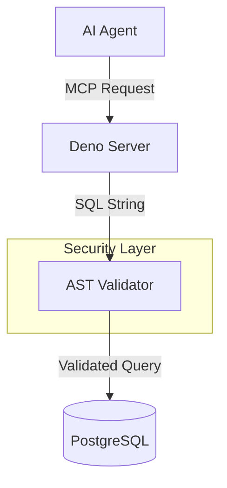

# Secure MCP Database Server (Demo)

> **A proof-of-concept for secure, read-only database access for AI Agents.**


## 📖 About This Project

This is a side project exploring how to safely connect Large Language Models
(LLMs) to internal databases using the **Model Context Protocol (MCP)**.

The goal was to answer a specific engineering question: **"How can we give an AI
agent access to SQL data without risking the entire database?"**

Instead of just giving the agent a connection string, this project implements a
**Security Gateway** pattern that enforces strict read-only access and validates
queries at the syntax level.

---

## 🛠️ Key Technical Features

This isn't just a wrapper around a database driver. It implements several layers
of defense:

### 1. AST-Based SQL Validation

Most "secure" SQL tools just use Regex. This project uses `pgsql-ast-parser` to
parse the actual **Abstract Syntax Tree** of the incoming query.

- **Enforced Read-Only:** If the AST contains `DROP`, `INSERT`, or `DELETE`, the
  query is rejected before it ever touches the database.
- **Schema Locking:** The parser verifies that the query _only_ targets allowed
  tables.

### 2. Zero-Trust Configuration

The application is built to fail fast.

- No hardcoded default passwords.
- No "fallback" configurations.
- If the environment variables aren't set, the server won't start.

### 3. Dynamic Token Safety

LLMs have limited context windows. If an agent runs `SELECT * FROM logs`, it
could crash the session.

- This server calculates a **Dynamic Row Limit** based on the complexity of the
  data to ensure the response fits safely within a standard context window.

---

## 🏗️ Architecture



---

## 🚀 How to Run It

You can run this locally to see the security rules in action.

### Prerequisites

- Docker & Docker Compose
- Deno v2.0+

### 1. Start the Database

I've included a `setup_db.ts` script that provisions a clean PostgreSQL instance
with a specific `mcp_agent` user (least-privilege).

```bash
docker-compose up -d
deno run --allow-net --allow-env setup_db.ts
```

### 2. Run the Server

```bash
deno run --allow-net --allow-read --allow-env main.ts
```

### 3. Test with an Agent

Connect any MCP-compatible client (like Claude Desktop) to the server. Try
asking it to:

- "List all users" (Should work)
- "Delete the users table" (Should fail with a security violation)

---

## 📝 License

MIT License. Feel free to use this code as a reference for your own secure MCP
implementations.
